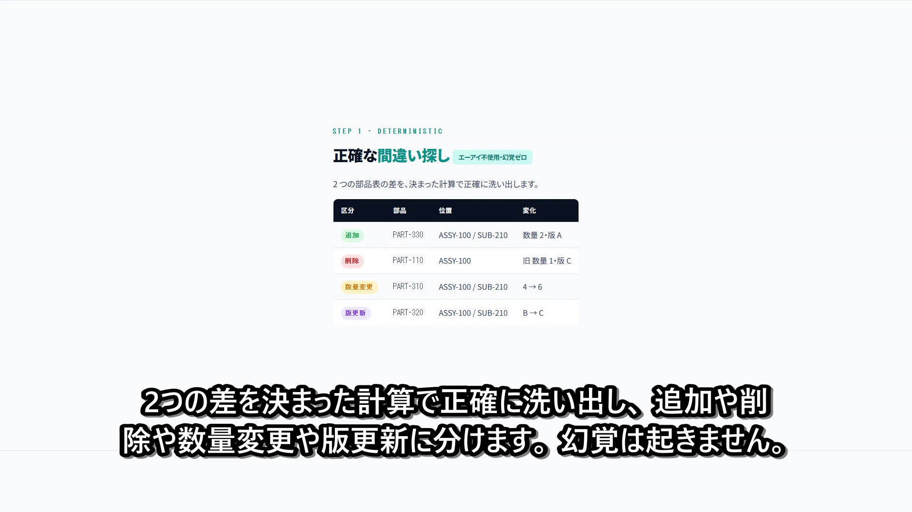

# plm-changelens

**Deterministic BOM (bill of materials) diff with an optional AI layer that
drafts the change-impact and the requirement / test-spec updates — built for
regulated (medical-device) PLM change control.**

When a product's parts list changes, regulated industries must trace every
change through to the requirements, design and test documents it affects. Doing
that by hand is slow and error-prone. `plm-changelens` does the mechanical part
exactly, and lets an LLM draft the paperwork — keeping the safety-critical
computation deterministic and the writing assistive.

## Demo

[](video/out/plm_changelens_demo.mp4)

A ~90s narrated walkthrough ([`video/out/plm_changelens_demo.mp4`](video/out/plm_changelens_demo.mp4)):
two BOM versions → deterministic 4-category diff → AI impact summary → EARS
requirement / test drafts → traceability impact. All data shown is synthetic.

## Why this split matters

```
┌─ core/  (deterministic, no LLM, no network) ──────────────┐
│  Compare two BOM versions → exactly which parts were       │
│  added / removed / had quantity or revision changes,       │
│  with the hierarchical path of each change.                │
└────────────────────────────────────────────────────────────┘
            │  (a precise, hallucination-free change set)
            ▼
┌─ llm/  (optional, provider-swappable, off by default) ─────┐
│  Turn the change set into a plain-language impact summary   │
│  and DRAFT updates to the affected requirements / tests.    │
│  Every claim is traced back to a concrete change.           │
└────────────────────────────────────────────────────────────┘
```

The part that affects safety (what changed) never depends on a language model.
Only the writing assistance does — and the tool runs fully without it.

## Positioning

- **Problem**: in regulated PLM (e.g. medical devices under IEC 62304), every BOM
  change must be traced to the requirements / design / test artifacts it touches.
  This is done manually today — slow and error-prone.
- **Who it's for**: engineers and quality staff doing PLM change control who want
  AI to draft the change paperwork without trusting AI for the actual change math.
- **vs. existing tools**: generic structural-diff libraries (e.g. `zss`,
  `DeepDiff`) compute tree/object differences but know nothing about BOM
  semantics or change documentation; requirements tools (e.g. `Doorstop`,
  `Sphinx-Needs`) manage traceability but don't derive impact from a BOM diff.
  `plm-changelens` is the **integration**: BOM-semantic diff → traceability
  impact → AI-drafted change docs. No single existing tool spans that path
  (see [ADR-0001](docs/adr/0001-prior-art-audit.md)).

## Quick start (no install, no account, no card)

```bash
# deterministic diff, human-readable (no LLM, no network)
PYTHONPATH=src python -m plm_changelens.cli diff examples/bom_old.csv examples/bom_new.csv

# machine-readable JSON
PYTHONPATH=src python -m plm_changelens.cli diff old.csv new.csv --format json

# traceability-table impact: which requirement/design/test links are affected
PYTHONPATH=src python -m plm_changelens.cli trace examples/bom_old.csv examples/bom_new.csv examples/trace_table.csv
```

### Optional LLM layer (off by default)

```bash
# change-impact summary; default provider is an offline deterministic mock
PYTHONPATH=src python -m plm_changelens.cli impact old.csv new.csv

# requirement/test-spec update DRAFTS (EARS-formatted, review-required)
PYTHONPATH=src python -m plm_changelens.cli draft old.csv new.csv

# use a real local model instead of the mock:
LLM_PROVIDER=ollama PYTHONPATH=src python -m plm_changelens.cli impact old.csv new.csv
```

Providers: `mock` (default, offline), `ollama` (local), `workers_ai` (free-tier
hosted, opt-in with credentials). Swap with `LLM_PROVIDER` or `--llm-provider`.

### BOM CSV format

| column | meaning |
|---|---|
| `level` | hierarchy level; the single `level=0` row is the top assembly |
| `part_number` | part identity |
| `quantity` | numeric quantity |
| `revision` | revision string (e.g. `A`, `01`) |

Extra columns (description, supplier, …) are preserved. Malformed input is
rejected with the offending row number — the tool never guesses.

## Tech stack

Python 3.11+ (standard library only at runtime; `pytest` + `ruff` for dev).
No third-party runtime dependencies, no database, no network unless an external
LLM provider is explicitly selected.

## Design

- **Dependency-free runtime** (`dependencies = []`): the deterministic core uses
  only the standard library. New dependencies require an ADR.
- **Domain-agnostic core + domain pack**: `core/` (abstract tree diff) is reused
  via `packs/plm/` (BOM semantics), so the engine ports to other domains.
- **Provider-swappable LLM** via `LLM_PROVIDER` env var; defaults to local/free,
  tests use a deterministic mock (no network).

Architecture decisions: [`docs/adr/`](docs/adr/). Prior-art audit:
[`docs/adr/0001-prior-art-audit.md`](docs/adr/0001-prior-art-audit.md).

## Result & approach

The driving idea was to keep the **safety-critical computation deterministic**
and push the LLM to the edge. The build followed that: a dependency-free
Zhang-Shasha tree-edit-distance core produces the exact change set; the LLM only
explains it, and even then each explanation is **structurally bound** to the
change that produced it, so a weak or swapped model cannot corrupt traceability.
The clearest lesson was that the valuable part is the *integration* — no single
existing library spans BOM-diff → traceability → drafted docs, so that glue
(and the determinism boundary) is where the design effort went.

## Status

Implemented and tested (36 tests): the deterministic core + CLI (`diff`,
`trace`) and the optional LLM layer (`impact`, `draft`) with provider swap.
Remaining: documentation polish, packaging, and broader BOM-format coverage.

## Limitations (honest disclosure)

- Input is a **generic CSV / intermediate format**. Direct connectors to
  commercial PLM systems (Windchill, Teamcenter, …) are out of scope; live data
  integration belongs to a deployment phase.
- The traceability output is an internal JSON model. Conformance to a specific
  regulatory submission format (ReqIF / IEC 62304 deliverables) is not yet
  guaranteed and would need a conversion layer.
- Tree-diff cost grows with BOM size; very large BOMs (thousands of nodes) may
  need the APTED variant (see ADR-0002).
- Part identity is the part number. Child line order is treated as
  insignificant (canonicalized before diff); a part moved to a *different*
  parent is reported as a remove + add (with both paths), which is intended.
- The AI impact/draft layer makes one model call per change, so very large
  change sets are slow with a real provider (the deterministic `diff`/`trace`
  are unaffected).

## License

MIT — see [LICENSE](LICENSE).
